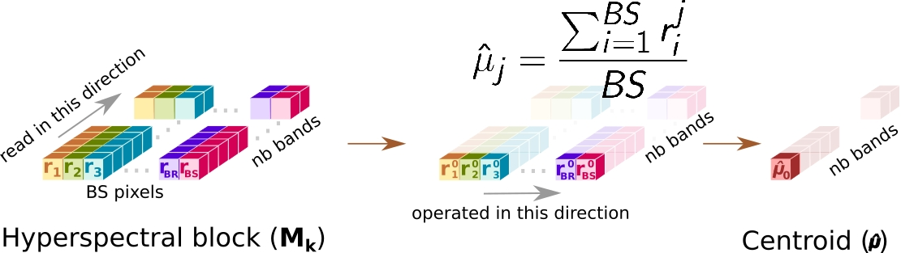
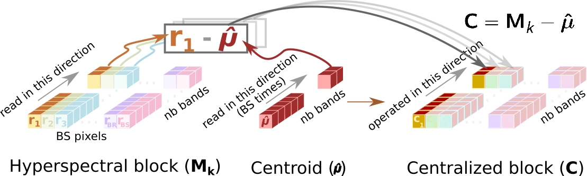
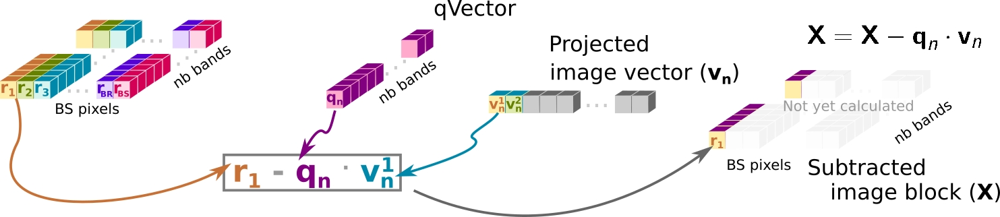

# Algoritmo de detección de anomalías en imágenes hiperespectrales

El detector de anomalías LbL-FAD (Line by Line Fast Anomaly Detector), desarrollado por el Instituto Universitario de Microelectrónica Aplicada de la Universidad de Las Palmas de Gran Canaria, es un detector de anomalías inspirado en el proceso Gram-Schmidt, que permite construir un mapa de anomalías a través de tres grandes etapas mediante el uso de un conjunto de operaciones vectoriales.

Para esta práctica se facilita una imagen hiperespectral compuesta por 825 líneas o bloques, donde cada bloque está formado por 1024 píxeles hiperespectrales, es decir, el tamaño espacial corresponde a una imagen de 825x1024, mientras que la componente espectral recoge 160 longitudes de onda diferentes (bandas).

## Etapa 1: Extracción del background

La primera etapa del algoritmo HW-LbL-FAD (función *LBL_FAD_Stage1* llamada dentro de *runDetector*) consiste en la selección de un conjunto de espectros de referencia representativos del fondo. Para ello, las primeras 100 líneas o bloques hiperespectrales serán utilizadas aplicando las siguientes operaciones.

### 1. Obtención del pixel medio (û)
Se obtiene el pixel medio de la imagen sumando cada valor por banda y dividiendo dicho sumatorio por el tamaño del bloque (función *averagePixel*).

### 2. Centralizado del bloque \(C\)
Esta operación consiste en restar el píxel medio, calculado en la etapa anterior, a cada píxel hiperespectral del bloque (función *duplicateAndCentralized*). En este paso el bloque original se conserva.

### 3. Obtención de los vectores u y q, mediante el cálculo del brillo
Esta etapa consiste en recorrer el bloque centralizado C y obtener los brillos de cada uno de los pixeles que componen dicho bloque, seleccionando aquel cuyo valor es mayor para el calculo de los vectores ortogonales (función *brighness* y *quVectors*).

- Cálculo del brillo:

$$ b_j = \sum_{i=nb}^{nb} (c_{i}^{2}) $$

Donde $b_j$ corresponde al cálculo del brillo de un pixel hiperespectral y $c_i$ al valor de la banda *i* del pixel *j*.

- Cálculo del vector **q**:

$$ q = c_{jmax} $$

El vector **q** corresponde al píxel de mayot brillo

- Cálculo del vector **u**:

$$ u = \frac{q}{b_{jmax}} $$

El vector *u* corresponde al pixel con mayor brillo, cuyos valores de cada una de sus bandas ha sido dividido por el valor del brillo de dicho pixel.

### 4. Proyección de la imagen sobre el vector u (v)
El bloque hiperespectral es proyectado sobre el vector *u*, obteniendo la imagen proyectada en el vector *v*. Para dicha operación se realiza el producto escalar de uno de los pixeles de la imagen ($r_i$) con el vector *u* (función *projectingImg*).

### 5. Sustracción de información
Se extrae la información mediante el producto escalar del vector *q* con el vector *v* (obtenido en el paso anterior), el cual es restado al pixel correspondiente del bloque hiperespectral (función *subtractingInformation*).

Los pasos 3 a 5 se repetirán hasta que la función *stop_condition* determine que ese bloque está lo suficientemente representado por los píxeles extraídos, es decir la salida de esta etapa son los índices de los bloques que representan al background, donde *n_indexes* representa el número de índices extraídos; *bg_indexes* la posición del píxel extraído dentro del bloque n y *bg_block* identificador del bloque. *bg_indexes* y *bg_block*, tienen el mismo tamaño (*n_indexes*), cuyos datos hacen referencia a pixel y bloque respectivamente, es decir un valor 512 en la posición 10 de *bg_indexes* y un valor 2 en la misma posición en el vector *bg_block* indica que el décimo pixel extraído corresponde al 512 del bloque 2.

## Etapa 2: Estimación del subespacio de los espectros de referencia
Dado que los bloques hiperespectrales se procesan de forma independiente en la Etapa 1 descartando cualquier restricción de alineación espacial, los píxeles extreídos en dicha etapa comprenden varios espectros iguales. Como consecuencia, se requiere obtener un subconjunto de los píxeles más diferentes que definan mejor la distribución del fondo, es decir, modelar el fondo (función *LBL_FAD_Stage2* llamada dentro de *runDetector*). Para ello, se crea un único bloque compuesto por los píxeles extraídos de la Etapa 1 y se aplica de nuevo el conjunto de operaciones básicas de la Etapa anterior, es decir se aplican las siguientes operaciones:

1. Obtención del pixel medio (û)
2. Centralizado del bloque \(C\)
3. Obtención de los vectores u y q, mediante el cálculo del brillo
4. Proyección de la imagen sobre el vector u (v)
5. Sustracción de información
Repetir las operaciones 3 a 5 hasta que *stop_condition* lo indique.

La salida de esta etapa corresponderá al conjunto de vectores q y u extraídos, que son almacenados en las matrices *qMatrix* y *uMatrix*, respectivamente. También se incluye la cantidad de vectores ortogonales extraídos, *numQU*, y el centroide o píxel medio del background, *centroid*. Por último, la función *stop_condition* proporcionará el umbral que permitirá determinar en la etapa 3 si un píxel es una anomalía o no.

## Etapa 3: Cálculo del subespacio ortogonal abarcado por el patrón de fondo y detección de espectros anómalos

La Etapa 3 (función *LBL_FAD_Stage3_4* llamada dentro de *runDetector*) del algoritmo LbL-FAD se centra en el cálculo de la matriz del subespacio ortogonal, para posteriormente determinar si ese píxel se trata de una anomalía. Desde el punto de vista de la arquitectura, esta etapa es la que más difiere del resto, ya que sólo reutiliza tres operadores hiperespectrales y añade un nuevo cálculo del brillo. Las operaciones se aplicarán a los 725 bloques restantes de la imagen.

### 1. Centralizado de la imagen
La diferencia con el centralizado realizado en la Etapa 1 reside en que el píxel medio no corresponde al bloque actual, si no que corresponde al bloque del fondo y que es una de las salidas de la Etapa 2. El proceso es el mismo, consiste en restar el píxel medio del fondo a cada píxel hiperespectral del bloque (usando la misma función *duplicateAndCentralized*).

### 2. Proyección de la imagen sobre el subespacio ortogonal del fondo y substracción de información
El bloque hiperespectral centralizado es proyectado sobre cada uno de los vectores almacenados en *uMatrix* de forma ordenada, es decir, se proyectará sobre el primer vector ortogonal *u*, para obtener la imagen proyectada en el vector *v* y posteriormente se realizará la sustracción de información antes de proyectar de nuevo la imagen con el siguiente vector ortogonal. Por lo tanto, este paso se ejecutara *numQU* veces.

#### 2.1 Proyección de la imagen sobre el vector $u_i$ ($v_i$)
Para dicha operación se realiza el producto escalar de uno de los píxeles de la imagen ($r_i$) con el vector $u_i$ almacenado en la matriz *uMatrix* (función *projectingImg*).

#### 2.2 Sustracción de información
Se extrae la información mediante el producto escalar del vector $q_i$ con el vector $v_i$ (obtenido en el paso anterior), el cual es restado al pixel correspondiente del bloque hiperespectral (función *subtractingInformation*).

### 3. Obtención del mapa de anomalías
En esta etapa se hace uso de una nueva función llamada *brightnessAD* que se encarga de obtener el mapa de anomalías mediante la identificación de los píxeles anómalos. La funcion procesara la imagen resultante del anterior paso obteniendo el brillo de cada uno de los píxeles del bloque y los comparara con el umbral obtenido en la Etapa 2, para determinar si el píxel se trata de una anomalía o no.

Si deseas ampliar información sobre el algoritmo LbLFAD, puedes encontra dicha información en los siguentes papers: [Articulo JSTARS](https://ieeexplore.ieee.org/document/9733282) [Artículo JCER](https://uclm-arco.github.io/curricula/2022-JCER-julian.caba.pdf).

**Nota:** La imagen hiperespectral se encuentra almacenada en el siguiente [enlace](https://mega.nz/folder/x4gRhLJJ#GRdxQc1Hnw3Lk_-9JC3Uew). Deberéis modificar el fichero *Configurations.h* para que la definicion *INPUT_FILE_NAME* apunte al path donde se encuentre la imagen. También se os proporciona tres ficheros en el directorio *golden* con las salidas de los índices seleccionados en la etapa 1 (*IndexS1*), los índices seleccionados en la etapa 2 (*IndexS2*) y el mapa de anomalías (*AD_map*). Esos ficheros podéis utilizarlos con alguna herramienta de comparación (*diff* o *meld*) para determinar si la versión paralelizada obtiene los mismos resultados que la secuencial.

----

# Hyperspectral Image Anomaly Detection Algorithm
The LbL-FAD (Line by Line Fast Anomaly Detector) anomaly detector, developed by the Applied Microelectronics University Institute at the University of Las Palmas de Gran Canaria, is an anomaly detector inspired by the Gram-Schmidt process, allowing the construction of an anomaly map through three major stages using a set of vector operations.

For this practice, a hyperspectral image is provided, consisting of 825 lines or blocks, where each block is made up of 1024 hyperspectral pixels. The spatial size thus corresponds to an 825x1024 image, while the spectral component captures 160 different wavelengths (bands).

## Stage 1: Background Extraction

The first stage of the HW-LbL-FAD algorithm (the *LBL_FAD_Stage1* function called within *runDetector*) involves selecting a set of reference spectra representative of the background. For this, the first 100 hyperspectral lines or blocks are used by applying the following operations.

### 1. Calculation of the Mean Pixel (û)
The mean pixel of the image is obtained by summing each value per band and dividing the total by the block size (function *averagePixel*).

### 2. Block Centering \(C\)
This operation involves subtracting the mean pixel calculated in the previous stage from each hyperspectral pixel in the block (function *duplicateAndCentralized*). The original block is retained at this stage.

### 3. Obtaining the u and q Vectors by Calculating Brightness

This stage involves scanning the centralized block C to obtain the brightness values of each pixel, selecting the pixel with the highest brightness to calculate the orthogonal vectors (functions *brightness* and *quVectors*).

- Brightness calculation:

$$ b_j = \sum_{i=nb}^{nb} (c_{i}^{2}) $$

where $b_j$​ is the brightness calculation for a hyperspectral pixel and ​$c_i$ is the value of band *i* for pixel *j*.

- Calculation of vector **q**:

$$ q = c_{jmax} $$

The vector **q** corresponds to the pixel with the highest brightness.

- Calculation of vector **u**:

$$ u = \frac{q}{b_{jmax}} $$

The vector **u** corresponds to the brightest pixel, with each of its band values divided by the brightness value of that pixel.

### 4. Image Projection onto Vector u (v)

The hyperspectral block is projected onto vector u, obtaining the image projected on vector *v*. This operation involves the dot product of one of the image pixels ($r_i$) with the vector *u* (function *projectingImg*).

### 5. Information Subtraction

Information is extracted by performing the dot product of vector *q* with vector *v* (obtained in the previous step), and subtracting it from the corresponding pixel in the hyperspectral block (function *subtractingInformation*).

Steps 3 to 5 will repeat until the *stop_condition* function determines that this block is sufficiently represented by the extracted pixels. The output of this stage is the indices of the blocks representing the background, where *n_indexes* represents the number of extracted indices; *bg_indexes* is the position of the extracted pixel within block n, and *bg_block* identifies the block. *bg_indexes* and *bg_block* have the same size (*n_indexes*), with data referencing pixel and block respectively (e.g., a value of 512 at position 10 in *bg_indexes* and a value of 2 at the same position in *bg_block* indicates that the tenth extracted pixel corresponds to pixel 512 of block 2).

## Stage 2: Estimation of the Subspace of Reference Spectra

Since the hyperspectral blocks are processed independently in Stage 1, discarding any spatial alignment constraints, the pixels extracted in this stage comprise several identical spectra. Consequently, it is necessary to obtain a subset of the most different pixels to better define the background distribution, i.e., to model the background (function *LBL_FAD_Stage2* called within *runDetector*). To do this, a single block is created, consisting of the pixels extracted in Stage 1, and the set of basic operations from the previous stage is reapplied, meaning the following operations are repeated:

1. Calculation of the Mean Pixel (û)
2. Block Centering \(C\)
3. Obtaining the u and q Vectors by Calculating Brightness
4. Image Projection onto Vector u (v)
5. Information Subtraction Repeat operations 3 to 5 until the *stop_condition* function indicates.

The output of this stage is the set of extracted q and u vectors stored in the matrices *qMatrix* and *uMatrix*, respectively. It also includes the number of extracted orthogonal vectors, *numQU*, and the centroid or mean pixel of the background, *centroid*. Finally, the *stop_condition* function provides the threshold that will determine in Stage 3 if a pixel is an anomaly.

## Stage 3: Calculation of the Orthogonal Subspace Covered by the Background Pattern and Detection of Anomalous Spectra

Stage 3 (function *LBL_FAD_Stage3_4* called within *runDetector*) of the LbL-FAD algorithm focuses on calculating the orthogonal subspace matrix to determine if a pixel is an anomaly. Architecturally, this stage differs the most from the others as it only reuses three hyperspectral operators and adds a new brightness calculation. The operations will be applied to the remaining 725 blocks of the image.

### 1. Image Centering
The difference from the centering done in Stage 1 is that the mean pixel corresponds to the background block, which is one of the outputs from Stage 2. The process is the same: subtracting the background mean pixel from each hyperspectral pixel in the block (using the same function *duplicateAndCentralized*).

### 2. Projection of the Image onto the Background Orthogonal Subspace and Information Subtraction

The centralized hyperspectral block is projected onto each vector stored in *uMatrix* in an ordered manner, i.e., it is projected onto the first orthogonal vector *u*, obtaining the image projected onto vector *v*; then information is subtracted before projecting the image again with the next orthogonal vector. Thus, this step will execute *numQU* times.

#### 2.1 Projection of the Image onto Vector $u_i$ ($v_i$)
For this operation, the dot product of one of the image pixels ($r_i$) with the vector $u_i$ stored in the *uMatrix* is performed (function *projectingImg*).

#### 2.2 Information Subtraction
Information is extracted by performing the dot product of vector $q_i$ with vector $v_i$ (obtained in the previous step) and subtracting it from the corresponding pixel in the hyperspectral block (function *subtractingInformation*).

### 3. Obtaining the Anomaly Map
In this stage, a new function called *brightnessAD* is used to obtain the anomaly map by identifying anomalous pixels. This function processes the resulting image from the previous step by calculating the brightness of each pixel in the block and comparing them to the threshold obtained in Stage 2 to determine if a pixel is an anomaly.

For more information on the LbL-FAD algorithm, refer to the following papers:  [JSTARS Article](https://ieeexplore.ieee.org/document/9733282) [JCER Article](https://uclm-arco.github.io/curricula/2022-JCER-julian.caba.pdf).

**Note:** The hyperspectral image is stored at the following [link](https://mega.nz/folder/x4gRhLJJ#GRdxQc1Hnw3Lk_-9JC3Uew). You should modify the *Configurations.h* file so that the *INPUT_FILE_NAME* definition points to the path where the image is located. Additionally, three files are provided in the golden directory with the outputs of the indices selected in stage 1 (*IndexS1*), the indices selected in stage 2 (*IndexS2*), and the anomaly map (*AD_map*). You can use these files with a comparison tool (*diff* or *meld*) to determine if the parallelized version yields the same results as the sequential version.
